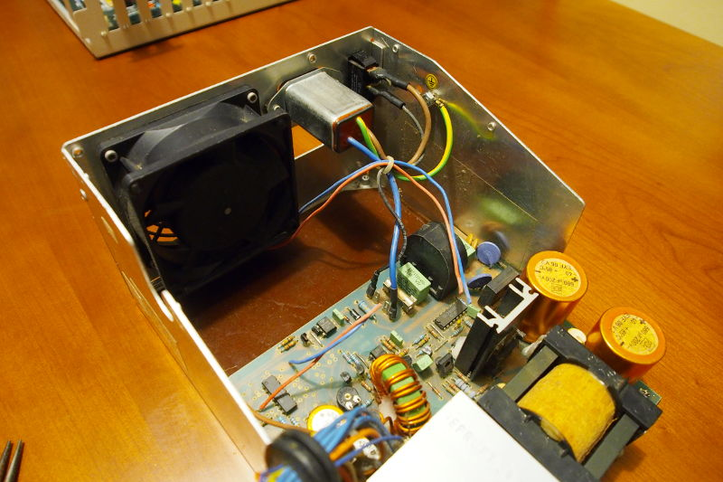

# Replace Amiga 2000 power supply unit with an ATX one

**WARNING: The author does not take any responsibility for any possible damage caused by the operation described in this guide. All steps should be done by someone who has proper knowledge on electronics.**

**WARNING: Inside power supply units you will find capacitors with large amounts of electricity charge, even when your computer is turned off. Touching those capacitors with your hands or tools is highly dangerous.**

## Introduction

In this guide I'll show how to replace an Amiga 2000 power supply, keeping 3 original components: the 80mm fan, the power connector (the one that connects to the motherboard) and the on/off switch.

Equipment you will need:

- Ian Steadman's adapter [Original/Big Box ATX](http://www.ianstedman.co.uk/Sales/IanStedmanscatalogue/ianstedmanscatalogue_2.html)
- ATX power supply unit with an 80mm fan
- Pliers for cutting wire
- A wire stripper (or your favorite tool for stripping wire – I use a knife)
- Wire connectors (I used a barrier strip/terminal block)
- Heat-shrink tubing

## Step 1: Adapter for ATX PSU

First you have to acquire an Ian Steadman adapter [Original/Big Box ATX](http://www.ianstedman.co.uk/Sales/IanStedmanscatalogue/ianstedmanscatalogue_2.html) that is sold in his website. 

There are other adapters out there but I think this one is great because it already supplies the TICK signal, unlike others.

In modern PCs, in order to turn your computer on, you have to turn on the PSU switch and you also have to press the Power button, usually in front of your PC. In our situation, we want the Amiga 2000 to turn on immediately after we turn on the power supply unit. For that to happen we have to setup the adapter for switch type "latch" and tick signal "50Hz":

1. Add a jumper in JP4 or connect a wire between the two small holes below the JP4 jumper;
2. Setup the two small switches in the adapter to the "On" position.

In the following image, the adapter is still without the jumper and with the two switches still in "Off" position.

The thing that this adapter is missing is the lead and connector to plug to the Amiga motherboard. But since we are not using our original PSU anymore, we can cut the wires of the original connector and reuse it:

After stripping all the wires from the connector, it's time to connect the ATX adapter. For that I used the table available in Ian Steadman's website ([here](http://www.ianstedman.co.uk/Amiga/amiga_hacks/Amiga_PSU/amiga_psu.html#wiringa1500)), which I have simplified like this:

| Amiga pin # | Description |
|:-----------:|:-----------:|
|1|+5V|
|2|+5V|
|3|+5V|
|4|+5V|
|5|GND|
|6|GND|
|7|GND|
|8|GND|
|9|+12V|
|10|KEYWAY|
|11|-12V|
|12|+5V User|
|13|-5V|
|14|Tick|

After connecting all the wires, you should end with something like this (colors may vary):

The lose wire (yellow) should connect to the Amiga pin #1. Looking at Ian Steadman's table, that pin doesn't connect to any wire coming out of the ATX PSU.

It's very important that you insulate that lose wire, using heat-shrink tubing or some similar technique.

## Step 2: Removing the original power supply unit

**WARNING: Inside power supply units you will find capacitors with large amounts of electricity charge, even when your computer is turned off. Touching those capacitors with your hands or tools is highly dangerous.**

Since we are removing only the inside of the original PSU, you have to unscrew and remove it's cover.

## Step 3: Cutting wires

**WARNING: Inside power supply units you will find capacitors with large amounts of electricity charge, even when your computer is turned off. Touching those capacitors with your hands or tools is highly dangerous.**

Now we are reaching the most critical part of this operation.

You have to cut the following wires in the original PSU:

- The wire that connects the power plug in the back of the PSU to the board (blue in the picture)
- The wire that connects the switch in the back of the PSU to the board (black in the picture)
- The two wires that connect to the fan

Next we have to remove the board from the inside of the metal box, leaving the brown insulating surface you will find below the board.

## Step 4: Opening the ATX power supply unit and cutting wires

**WARNING: Inside power supply units you will find capacitors with large amounts of electricity charge, even when your computer is turned off. Touching those capacitors with your hands or tools is highly dangerous.**

Now that we have removed the original PSU, it's time to remove the content of the ATX PSU so we can then put it where the original was.

For that, we only have to remove all the screws from the ATX PSU, open it, and remove its content, while being very carefull not to touch any capacitors.

Next, we have to cut the same wires we have cut in the original PSU, keeping in mind that the colors will most likely be different. I recommend taking some pictures before cutting the wires so you can review it lately.

After cutting all the wires, remove the board from its housing.

Now you should have something like this:

## Step 5: Putting the ATX PSU inside the Amiga

First, put the ATX PSU board inside the original PSU housing.

Next we have to connect the wires from the ATX PSU to the power plug, the fan and the power switch. To connect the wires, I used a barrier strip.

For that we have to match the wires that we cut previously.

In the end it should look like this:

## Step 6: Final touches

Now we can put back the original top cover of the original PSU and put all the screws back in the casing.

After that, you only have to connect the 20 pins connector that comes out of the ATX PSU to the Ian Steadman's adapter [Original/Big Box ATX](http://www.ianstedman.co.uk/Sales/IanStedmanscatalogue/ianstedmanscatalogue_2.html) and connect the 14 pins connector the Amiga motherboard.

You should also find some way to insulate the adapter making sure it doesn't touch anything in the motherboard. My solution is not the best looking one but it works: I made some cuts to the small anti-static bag that came with the adapter, put the adapter inside the bag, and left it hanging inside the Amiga. Truth be told, due to the stiffness of the wires, the adapter stays pretty stationary.

Don't forget to connect all the other wires too (floppy drive, hard drive, etc.)

Finally, turn your computer on. Hopefully, it will work.

**Author:** Tiago Epifânio

**License (all text and documents):** [CC BY-SA 4.0](https://creativecommons.org/licenses/by-sa/4.0/)

