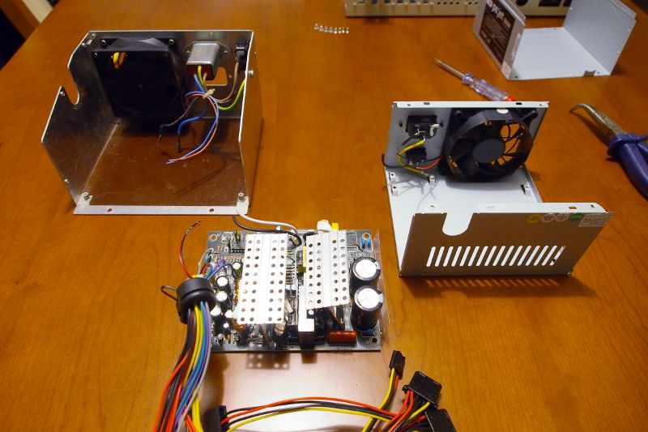

# Substituir a fonte de alimentação de um Amiga 2000 por uma fonte ATX

**ATENÇÃO: O autor deste guia não se responsabiliza por quaisquer danos realizados durante a operação aqui descrita. Os passos deverão ser realizados apenas por alguém com conhecimentos de electrónica.**

**ATENÇÃO: No interior das fontes de alimentação existem condensadores que armazenam elevadas cargas eléctricas, mesmo quando o computador se encontra desligado. Tocar nesses condensadores, com as mãos ou com ferramentas, é altamente perigoso.**

## Introdução

Neste guia irei mostrar como substituir a fonte de alimentação original do A2000, mantendo 3 componentes originais: a ventoinha de 80mm, a ficha de alimentação e o interruptor on/off.
Material necessário:

- Adaptador [Original/Big Box ATX](http://www.ianstedman.co.uk/Sales/IanStedmanscatalogue/ianstedmanscatalogue_2.html) vendido pelo Ian Steadman
- Fonte ATX com ventoinha de 80mm
- Alicate de corte
- Descarnador para cabos (ou a vossa forma preferida de descarnar – eu uso uma faca)
- Junções para fios (eu usei uma barra de junção e cortei consoante necessário)
- Fita isoladora ou manga termoretráctil

## Passo 1: Adaptador para fonte ATX

Inicialmente é necessário adquirir um adaptador [Original/Big Box ATX](http://www.ianstedman.co.uk/Sales/IanStedmanscatalogue/ianstedmanscatalogue_2.html) vendido pelo Ian Steadman. 

Existem outros adaptadores à venda, mas este tem a vantagem de já nos fornecer o sinal TICK, ao contrário dos outros.

[ inserir foto do adaptador do Ian Steadman ]

Nos PC’s modernos, para ligar o computador, temos de ter o interruptor da fonte ligado (ON) e para além disso temos de carregar no botão de Power, geralmente na parte frontal do computador.  No nosso caso, queremos que o Amiga 2000 se ligue de imediato ao ligar o interruptor da fonte de alimentação. Para isso é necessário configurar o adaptador para o switch type “latch” e sinal tick “50 Hz”:

1. Adicionar um jumper em JP4 ou ligar um fio entre os dois orifícios que se encontram abaixo do jumper JP4:

2. Configurar os dois pequenos interruptores que se encontram no adaptador para as posições “On”:

O que o adaptador não traz é um conector para ligar à board do Amiga. Por isso, e como já não vamos usar a fonte original, podemos cortar os fios do conector original e reaproveitá-lo:

Depois de descarnar todos os fios do conector, é altura de ligarmos o conector ao adaptador da fonte ATX. Para isso, guiei-me por uma tabela fornecida pelo Ian Steadman ([ver aqui](http://www.ianstedman.co.uk/Amiga/amiga_hacks/Amiga_PSU/amiga_psu.html#wiringa1500)), que simplifiquei:

| Amiga pin # | Descrição |
|:-----------:|:---------:|
|1|+5V|
|2|+5V|
|3|+5V|
|4|+5V|
|5|GND|
|6|GND|
|7|GND|
|8|GND|
|9|+12V|
|10|KEYWAY|
|11|-12V|
|12|+5V User|
|13|-5V|
|14|Tick|

Depois de ligar os fios, deverá ficar algo deste género (as cores podem variar):

O fio desligado (amarelo) é correspondente ao pin #1 do lado do Amiga. Tendo em conta a tabela do Ian Steadman, esse pin não tinha correspondência a nenhum pin da fonte ATX.

É muito importante isolar a ponta do fio desligado com um pouco de fita isoladora ou manga termoretráctil, tal como mostro na imagem seguinte:

## Passo 2: Remover a fonte de alimentação original

**ATENÇÃO: No interior das fontes de alimentação existem condensadores que armazenam elevadas cargas eléctricas, mesmo quando o computador se encontra desligado. Tocar nesses 
condensadores, com as mãos ou com ferramentas, é altamente perigoso.**

Como vamos remover apenas o conteúdo da fonte de alimentação original, retira-se a cobertura da mesma, tirando todos os parafusos que a seguram à caixa do computador. Para mexer no interior, é mais fácil remover a totalidade da fonte para fora do Amiga.

## Passo 3: Cortar fios

**ATENÇÃO: No interior das fontes de alimentação existem condensadores que armazenam elevadas cargas eléctricas, mesmo quando o computador se encontra desligado. Tocar nesses condensadores, com as mãos ou com ferramentas, é altamente perigoso.**

Agora entramos na parte mais crítica desta operação. 

É necessário cortar os seguintes fios na fonte original:

- Fio que liga a ficha traseira à board da fonte (azul, no meu caso)
- Fio que liga o interruptor à board da fonte (preto, no meu caso)
- Os dois fios que ligam à ventoinha

De seguida, retira-se a board da fonte de dentro da caixa metálica, deixando ficar no fundo da mesma a placa de plástico (castanha, no meu caso) que serve como isolante.

## Passo 4: Abrir a fonte ATX e cortar fios

**ATENÇÃO: No interior das fontes de alimentação existem condensadores que armazenam elevadas cargas eléctricas, mesmo quando o computador se encontra desligado. Tocar nesses condensadores, com as mãos ou com ferramentas, é altamente perigoso.**

Agora que já retirámos a fonte original, é altura de retirarmos o conteúdo da fonte ATX para, de seguinda, colocarmos no sítio da original.

Basta, para isso, retirar todos os parafusos da caixa da fonte ATX, abri-la, e retirar o conteúdo, sempre com cuidado para não tocar nos condensadores.

De seguida é preciso cortar na fonte ATX, os mesmos fios que cortámos anteriormente na fonte original, tendo em conta que as cores serão diferentes. Aconselho a tirar fotografias ao interior da fonte para saber como estavam ligados os fios antes de os cortar.

Depois de tudo cortado, retira-se a board de dentro da caixa.

Neste momento, deverão ter algo semelhante a isto:

## Passo 5: Colocar a fonte ATX no interior do Amiga

Agora vamos para o passo mais crítico.

Primeiro, coloca-se a board da fonte ATX dentro da caixa da fonte original.

De seguida é necessário ligar os fios da fonte ATX à ficha de alimentação, à ventoinha e ao interruptor. Para ligar os fios, eu usei uma barra de junção que cortei consoante as necessidades.

Para isso devemos fazer, com muita atenção, a correspondência entre os fios que cortámos em ambas as fontes, ou seja:

- O fio da fonte ATX que estava  ligado à ficha de alimentação (no meu caso, branco), deverá ser ligado ao único fio que se encontra cortado na ficha de alimentação da caixa original.
- O fio da fonte ATX que estava ligado ao interruptor (no meu caso, preto), deve ser ligado ao fio que se encontra cortado no interruptor da board original (no meu caso, preto, também).
- Os dois fios da fonte ATX que estavam ligados à ventoinha, deverão ser ligados à ventoinha da fonte original.

No final, o resultado deverá assemelhar-se a esta foto:

## Passo 6: Os retoques finais

Neste momento, podemos voltar a colocar a cobertura na caixa da fonte original e aparafusar a caixa ao Amiga.

Depois, é só ligar a ficha de 20 pins da fonte ATX ao adaptador [Original/Big Box ATX](http://www.ianstedman.co.uk/Sales/IanStedmanscatalogue/ianstedmanscatalogue_2.html) (Ian Steadman) e ligar a ficha de 14 pins que já tinhamos aparafusado ao adaptador, no Amiga.

Também é necessário arranjar uma forma de acomodar o adaptador dentro do Amiga, devidamente isolado para não tocar em nenhum componente da motherboard. A forma que arranjei de o fazer não é a mais elegante, mas funciona: fiz uns corte na pequena embalagem antiestática do adaptador, coloquei-o dentro da mesma, e deixei-o solto dentro da grande caixa do Amiga 2000. Na verdade, devido à rigidez dos fios, o adaptador fica praticamente imóvel.

Não se esqueçam de ligar também os cabos de alimentação da drive de disquetes, disco rígido, etc.

Por fim, testem o computador, ligando-o. Eu espero que funcione.

**Autoria:** Tiago Epifânio

**Licença do texto e fotografias:** [CC BY-SA 4.0](https://creativecommons.org/licenses/by-sa/4.0/)

